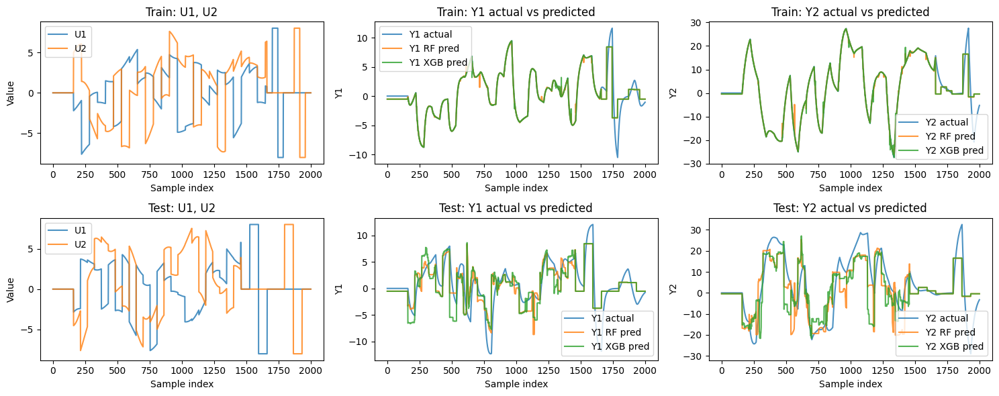
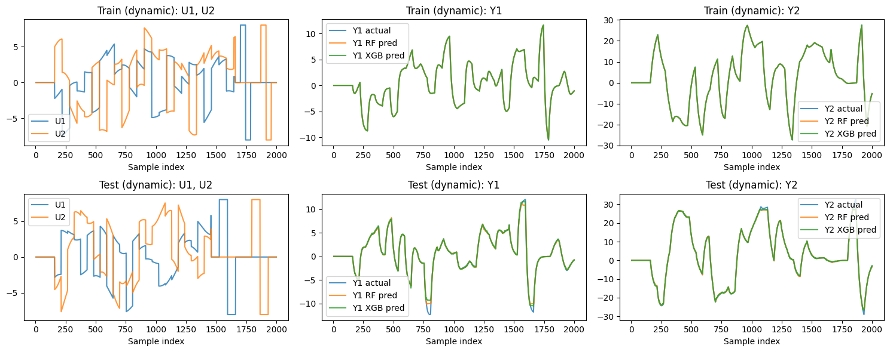

### Analysis 1 – simple dynamic surrogate (tutorial)

This folder contains a first "warm‑up" problem for building surrogate models on synthetic process data.

#### 1. What data do we have?

- The Excel file `simple_dynamic_process.xlsx` has two sheets: **Training Data** and **Testing Data**.
- Each sheet has a time index and four tag columns:
  - `Time` – just a sample counter (we do not use it as a model input).
  - `U1`, `U2` – process inputs.
  - `Y1`, `Y2` – process outputs.
- The data is noise‑free and comes from a simple dynamic test model.

#### 2. What problem are we solving?

We want a surrogate model that can predict the outputs (Y1, Y2) from the inputs (U1, U2), including the dynamic behaviour over time.  
The model should work on the **test** sheet, not just replay the training data.

#### 3. How do we solve it?

We use Random Forest and XGBoost as standard tree‑based ML baselines: they handle non‑linear relationships, need little feature scaling, and perform well with modest tuning. Using both lets us compare a simple ensemble (Random Forest) against a more flexible gradient‑boosted model (XGBoost), which is standard practice in surrogate‑modelling benchmarks.

The notebook `experiment.ipynb` walks through three steps:

1. **Data loading** — read the Excel file and split into training and testing sets, separating inputs (U1, U2) from outputs (Y1, Y2).

2. **Static models (no history)** — train Random Forest and XGBoost using only the current inputs U1(t), U2(t) to predict Y1(t), Y2(t), then evaluate on both train and test.

3. **Dynamic models (with history)** — build lagged features that include short histories of the inputs and past outputs, train both models again, and compare against the static results.

#### 4. What are the limitations?

- The data is synthetic and noise‑free; real plant data will be noisier and harder to model.
- Only two inputs and two outputs are considered; real systems may involve many more tags and interactions.
- The lag structure (how many past steps to include) is fixed by hand — a poor choice can hurt performance.
- The models are "black boxes": they approximate the mapping well but offer no physical insight or extrapolation guarantees.

#### 5. Results

On the **test** data, all four model configurations produce the following metrics:

| Model   | History | Output | MAE     | RMSE    | R2     |
|---------|---------|--------|---------|---------|--------|
| RF      | static  | Y1     | 2.0022  | 2.8493  | 0.5481 |
| RF      | static  | Y2     | 6.6148  | 9.1092  | 0.5822 |
| XGBoost | static  | Y1     | 2.2339  | 3.1198  | 0.4582 |
| XGBoost | static  | Y2     | 7.0429  | 9.7550  | 0.5208 |
| RF      | dynamic | Y1     | 0.1371  | 0.3419  | 0.9935 |
| RF      | dynamic | Y2     | 0.2348  | 0.5542  | 0.9985 |
| XGBoost | dynamic | Y1     | 0.1391  | 0.3924  | 0.9915 |
| XGBoost | dynamic | Y2     | 0.2278  | 0.5070  | 0.9987 |

The static models capture some of the behaviour but leave a lot of error (R2 around 0.5). Adding even a short history of past inputs and outputs cuts the error sharply — the dynamic models reach R2 above 0.99 for both outputs, meaning the surrogate tracks the test trajectories very closely.

The figures below show this visually for the dynamic XGBoost model:

How the prediction error changes over time on the test set — useful for spotting where the model struggles most.

True vs predicted curves for Y1 and Y2 over time, showing how closely the dynamic surrogate follows the process.

You can re‑run `experiment.ipynb` to regenerate the metrics and plots, or tweak the lag settings and model hyperparameters to see how the results change.
